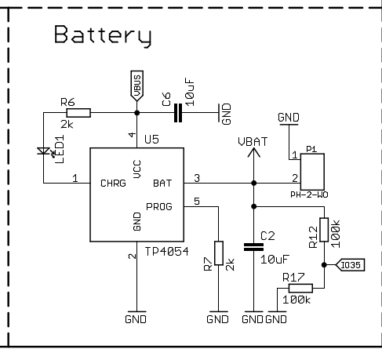
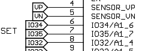

Experiment with ESP32... esp32iments
####################################

`Wemos schematics <docs/sch_d32_v1.0.0.pdf>`_

Battery section
---------------

Voltage sensor it attached to IO35 (A1_7) 

The voltage is divided by a voltage divider e.g. the two 100K resistors hence.. voltage * 2. At the same time the ESP32 ADC can normally only measure between 0 and 1.1. but an attenuation can be set  

vref?? 3.3?

https://esphome.io/components/sensor/adc.html

https://esphome.io/components/sensor/adc.html#adc-esp8266-vcc

https://esphome.io/cookbook/temt6000.html

.. code-block::

    sensor:
    - platform: adc
        pin: 35
        attenuation: 6db # 0 -> 2.2 volt
        unit_of_measurement: v
        name: "VBatt"
        # Increase for the voltage divider
        filters:
        - lambda: |-
                return (x * 2); 
        update_interval: 5s

log::

    [10:15:53][C][api:096]:   Address: wemos.local:6053
    [10:15:55][D][adc:056]: 'VBatt': Got voltage=2.17V
    [10:15:55][D][sensor:092]: 'VBatt': Sending state 4.34950 v with 2 decimals of accuracy
    [10:16:00][D][adc:056]: 'VBatt': Got voltage=2.20V
    [10:16:00][D][sensor:092]: 'VBatt': Sending state 4.40000 v with 2 decimals of accuracy
    [10:16:05][D][adc:056]: 'VBatt': Got voltage=2.20V
    [10:16:05][D][sensor:092]: 'VBatt': Sending state 4.40000 v with 2 decimals of accuracy
    [10:16:10][D][adc:056]: 'VBatt': Got voltage=2.20V
    [10:16:10][D][sensor:092]: 'VBatt': Sending state 4.40000 v with 2 decimals of accuracy
    [10:16:15][D][adc:056]: 'VBatt': Got voltage=1.80V
    [10:16:15][D][sensor:092]: 'VBatt': Sending state 3.59844 v with 2 decimals of accuracy
    [10:16:20][D][adc:056]: 'VBatt': Got voltage=1.09V
    [10:16:20][D][sensor:092]: 'VBatt': Sending state 2.18442 v with 2 decimals of accuracy
    [10:16:25][D][adc:056]: 'VBatt': Got voltage=0.00V
    [10:16:25][D][sensor:092]: 'VBatt': Sending state 0.00000 v with 2 decimals of accuracy
    [10:16:30][D][adc:056]: 'VBatt': Got voltage=0.00V
    [10:16:30][D][sensor:092]: 'VBatt': Sending state 0.00000 v with 2 decimals of accuracy
    [10:16:35][D][adc:056]: 'VBatt': Got voltage=0.00V
    [10:16:35][D][sensor:092]: 'VBatt': Sending state 0.00000 v with 2 decimals of accuracy
    [10:16:40][D][adc:056]: 'VBatt': Got voltage=0.00V
    [10:16:40][D][sensor:092]: 'VBatt': Sending state 0.00000 v with 2 decimals of accuracy
    [10:16:45][D][adc:056]: 'VBatt': Got voltage=0.00V
    [10:16:45][D][sensor:092]: 'VBatt': Sending state 0.00000 v with 2 decimals of accuracy
    [10:16:50][D][adc:056]: 'VBatt': Got voltage=0.00V
    [10:16:50][D][sensor:092]: 'VBatt': Sending state 0.00000 v with 2 decimals of accuracy
    [10:16:55][D][adc:056]: 'VBatt': Got voltage=0.00V
    [10:16:55][D][sensor:092]: 'VBatt': Sending state 0.00000 v with 2 decimals of accuracy
    [10:17:00][D][adc:056]: 'VBatt': Got voltage=0.01V
    [10:17:00][D][sensor:092]: 'VBatt': Sending state 0.01719 v with 2 decimals of accuracy
    [10:17:05][D][adc:056]: 'VBatt': Got voltage=0.00V
    [10:17:05][D][sensor:092]: 'VBatt': Sending state 0.00000 v with 2 decimals of accuracy
    [10:17:10][D][adc:056]: 'VBatt': Got voltage=0.27V
    [10:17:10][D][sensor:092]: 'VBatt': Sending state 0.53831 v with 2 decimals of accuracy
    [10:17:15][D][adc:056]: 'VBatt': Got voltage=2.20V
    [10:17:15][D][sensor:092]: 'VBatt': Sending state 4.40000 v with 2 decimals of accuracy

Resources
---------

* `esp32 gps tracker <https://www.iotdesignpro.com/projects/esp32-gps-tracker-iot-based-vehicle-tracking-system>`_

* esphome example.yaml run
